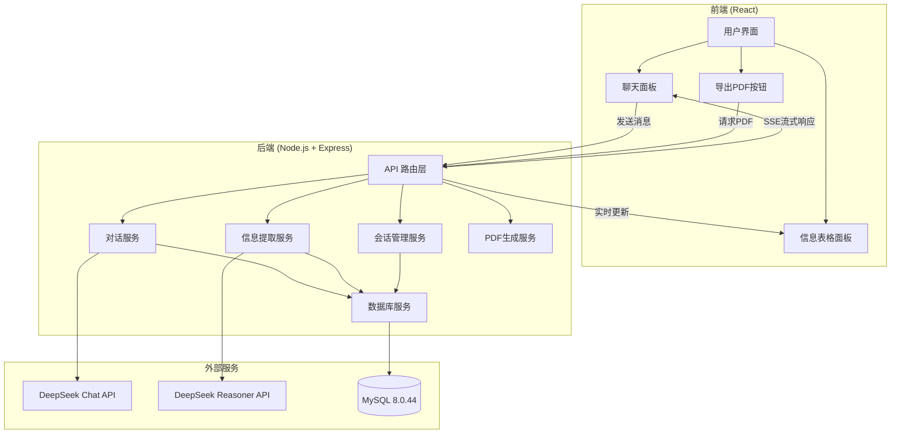
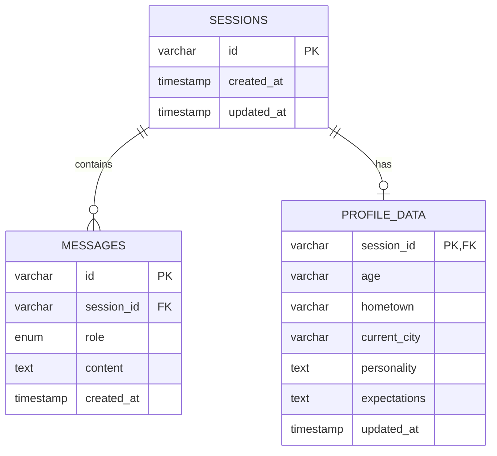

# 设计文档

## 概述

自然聊天信息提取器是一个基于 Web 的智能对话系统，采用前后端分离架构。系统通过 DeepSeek API 提供自然的对话体验，同时在后台智能提取用户信息并实时展示。核心设计理念是让信息收集过程自然流畅，用户不会感到被审问或采集数据。

### 技术栈

- **前端**: React + TypeScript + Tailwind CSS
- **后端**: Node.js + Express + TypeScript
- **数据库**: MySQL 8.0.44
- **AI 服务**: DeepSeek API (deepseek-chat + deepseek-reasoner)
- **PDF 生成**: pdfmake (声明式布局，适合表格生成)

### 架构原则

1. **前后端分离**: 前端负责 UI 交互，后端负责业务逻辑和数据持久化
2. **实时性**: 使用 Server-Sent Events (SSE) 实现流式对话和实时表格更新
3. **智能分析**: 双模型协作 - deepseek-chat 负责对话，deepseek-reasoner 负责信息提取和完善
4. **数据持久化**: 使用 MySQL 连接池管理数据库连接，支持会话管理和历史查询

## 架构

### 系统架构图



### 数据流

#### 对话流程
1. 用户在前端输入消息
2. 前端通过 POST 请求发送消息到后端
3. 后端调用 deepseek-chat API（流式模式）
4. 后端通过 SSE 将响应流式传输到前端
5. 前端实时显示 AI 回复
6. 对话消息保存到 MySQL

#### 信息提取流程
1. 后端维护消息计数器和定时器
2. 当满足触发条件（3条消息或1分钟）时
3. 后端调用 deepseek-reasoner 分析对话历史
4. deepseek-reasoner 返回结构化的用户信息
5. 后端更新数据库中的 Profile_Data
6. 后端通过 WebSocket 或轮询通知前端更新
7. 前端实时刷新右侧信息表格

## 组件和接口

### 前端组件

#### 1. App 组件
主应用容器，管理全局状态和路由。

```typescript
interface AppState {
  currentSessionId: string | null;
  sessions: Session[];
  isLoading: boolean;
}

interface Session {
  id: string;
  createdAt: Date;
  updatedAt: Date;
  preview: string; // 会话简要预览
}
```

#### 2. ChatPanel 组件
左侧聊天界面，负责消息显示和输入。

```typescript
interface ChatPanelProps {
  sessionId: string;
  messages: Message[];
  onSendMessage: (content: string) => void;
  isStreaming: boolean;
}

interface Message {
  id: string;
  role: 'user' | 'assistant';
  content: string;
  timestamp: Date;
}
```

#### 3. ProfilePanel 组件
右侧信息表格面板，实时显示提取的用户信息。

```typescript
interface ProfilePanelProps {
  profileData: ProfileData;
  isUpdating: boolean;
}

interface ProfileData {
  age: string | null;
  hometown: string | null;
  currentCity: string | null;
  personality: string | null;
  expectations: string | null;
  lastUpdated: Date;
}
```

#### 4. ExportButton 组件
PDF 导出按钮。

```typescript
interface ExportButtonProps {
  sessionId: string;
  onExport: () => Promise<void>;
  disabled: boolean;
}
```

### 后端服务

#### 1. ChatService
处理对话逻辑和 DeepSeek Chat API 调用。

```typescript
class ChatService {
  /**
   * 发送消息并获取流式响应
   */
  async sendMessage(
    sessionId: string,
    userMessage: string,
    onChunk: (chunk: string) => void
  ): Promise<void>;
  
  /**
   * 获取对话历史
   */
  async getConversationHistory(sessionId: string): Promise<Message[]>;
  
  /**
   * 调用 DeepSeek Chat API
   */
  private async callDeepSeekChat(
    messages: Message[],
    stream: boolean
  ): Promise<ReadableStream | string>;
}
```

#### 2. ProfileService
处理信息提取和 DeepSeek Reasoner API 调用。

```typescript
class ProfileService {
  private messageCounter: Map<string, number>;
  private lastReasonerCall: Map<string, Date>;
  
  /**
   * 检查是否需要触发 Reasoner
   */
  shouldTriggerReasoner(sessionId: string): boolean;
  
  /**
   * 调用 DeepSeek Reasoner 分析对话并提取信息
   */
  async analyzeAndExtractProfile(sessionId: string): Promise<ProfileData>;
  
  /**
   * 更新 Profile Data
   */
  async updateProfileData(
    sessionId: string,
    profileData: Partial<ProfileData>
  ): Promise<void>;
  
  /**
   * 获取当前 Profile Data
   */
  async getProfileData(sessionId: string): Promise<ProfileData>;
}
```

#### 3. SessionService
管理会话生命周期。

```typescript
class SessionService {
  /**
   * 创建新会话
   */
  async createSession(): Promise<string>;
  
  /**
   * 获取会话列表
   */
  async listSessions(): Promise<Session[]>;
  
  /**
   * 获取会话详情
   */
  async getSession(sessionId: string): Promise<SessionDetail>;
  
  /**
   * 删除会话
   */
  async deleteSession(sessionId: string): Promise<void>;
}

interface SessionDetail {
  id: string;
  createdAt: Date;
  updatedAt: Date;
  messages: Message[];
  profileData: ProfileData;
}
```

#### 4. DatabaseService
数据库操作封装。

```typescript
class DatabaseService {
  private pool: mysql.Pool;
  
  /**
   * 初始化数据库连接池
   */
  constructor(config: mysql.PoolOptions);
  
  /**
   * 保存消息
   */
  async saveMessage(sessionId: string, message: Message): Promise<void>;
  
  /**
   * 获取消息历史
   */
  async getMessages(sessionId: string): Promise<Message[]>;
  
  /**
   * 保存/更新 Profile Data
   */
  async saveProfileData(
    sessionId: string,
    profileData: ProfileData
  ): Promise<void>;
  
  /**
   * 获取 Profile Data
   */
  async getProfileData(sessionId: string): Promise<ProfileData>;
  
  /**
   * 创建会话
   */
  async createSession(): Promise<string>;
  
  /**
   * 删除会话及相关数据
   */
  async deleteSession(sessionId: string): Promise<void>;
}
```

#### 5. PDFService
PDF 生成服务。

```typescript
class PDFService {
  /**
   * 生成 PDF 文档
   */
  async generatePDF(
    sessionId: string,
    profileData: ProfileData
  ): Promise<Buffer>;
  
  /**
   * 创建 PDF 文档定义
   */
  private createDocDefinition(profileData: ProfileData): any;
}
```

### API 端点

#### 会话管理
- `POST /api/sessions` - 创建新会话
- `GET /api/sessions` - 获取会话列表
- `GET /api/sessions/:id` - 获取会话详情
- `DELETE /api/sessions/:id` - 删除会话

#### 对话
- `POST /api/sessions/:id/messages` - 发送消息（SSE 流式响应）
- `GET /api/sessions/:id/messages` - 获取消息历史

#### 信息提取
- `GET /api/sessions/:id/profile` - 获取当前 Profile Data
- `POST /api/sessions/:id/profile/analyze` - 手动触发信息分析

#### 导出
- `GET /api/sessions/:id/export/pdf` - 导出 PDF

## 数据模型

### 数据库表结构

#### sessions 表
```sql
CREATE TABLE sessions (
  id VARCHAR(36) PRIMARY KEY,
  created_at TIMESTAMP DEFAULT CURRENT_TIMESTAMP,
  updated_at TIMESTAMP DEFAULT CURRENT_TIMESTAMP ON UPDATE CURRENT_TIMESTAMP,
  INDEX idx_created_at (created_at)
) ENGINE=InnoDB DEFAULT CHARSET=utf8mb4 COLLATE=utf8mb4_unicode_ci;
```

#### messages 表
```sql
CREATE TABLE messages (
  id VARCHAR(36) PRIMARY KEY,
  session_id VARCHAR(36) NOT NULL,
  role ENUM('user', 'assistant') NOT NULL,
  content TEXT NOT NULL,
  created_at TIMESTAMP DEFAULT CURRENT_TIMESTAMP,
  FOREIGN KEY (session_id) REFERENCES sessions(id) ON DELETE CASCADE,
  INDEX idx_session_created (session_id, created_at)
) ENGINE=InnoDB DEFAULT CHARSET=utf8mb4 COLLATE=utf8mb4_unicode_ci;
```

#### profile_data 表
```sql
CREATE TABLE profile_data (
  session_id VARCHAR(36) PRIMARY KEY,
  age VARCHAR(50),
  hometown VARCHAR(100),
  current_city VARCHAR(100),
  personality TEXT,
  expectations TEXT,
  updated_at TIMESTAMP DEFAULT CURRENT_TIMESTAMP ON UPDATE CURRENT_TIMESTAMP,
  FOREIGN KEY (session_id) REFERENCES sessions(id) ON DELETE CASCADE
) ENGINE=InnoDB DEFAULT CHARSET=utf8mb4 COLLATE=utf8mb4_unicode_ci;
```

### 数据关系




## 正确性属性

*属性是一个特征或行为，应该在系统的所有有效执行中保持为真——本质上是关于系统应该做什么的形式化陈述。属性作为人类可读规范和机器可验证正确性保证之间的桥梁。*

### 属性 1: API 流式调用配置

*对于任何*对 DeepSeek Chat API 的调用，系统应该将 stream 参数设置为 true 以启用流式输出。

**验证: 需求 1.6, 6.5**

### 属性 2: 信息提取和更新

*对于任何*包含用户信息（年龄、城市、性格、期待对象）的对话消息，当 DeepSeek Reasoner 分析后，相应的 Profile_Data 字段应该被更新。

**验证: 需求 2.1, 2.2, 2.3, 2.4, 2.5**

### 属性 3: Profile 数据同步

*对于任何* Profile_Data 的更新，前端 Profile_Table 应该反映相同的数据状态。

**验证: 需求 2.6**

### 属性 4: Reasoner 触发机制

*对于任何*会话，当消息计数达到 3 或时间间隔达到 1 分钟时，系统应该触发 DeepSeek Reasoner 调用。

**验证: 需求 3.1, 3.2**

### 属性 5: Reasoner 调用完整性

*对于任何* DeepSeek Reasoner 调用，系统应该传递完整的对话历史和当前 Profile_Data 作为上下文。

**验证: 需求 3.3, 7.2, 7.6**

### 属性 6: Reasoner 调用后状态重置

*对于任何* DeepSeek Reasoner 调用完成后，系统应该重置 Message_Counter 为 0 并重置 Reasoner_Timer。

**验证: 需求 3.5**

### 属性 7: PDF 内容完整性

*对于任何* Profile_Data，生成的 PDF 应该包含所有字段（年龄、家庭城市、现居城市、性格、期待对象）及其对应的值或"待了解"标记。

**验证: 需求 4.4, 4.5**

### 属性 8: 消息显示一致性

*对于任何*用户发送的消息，该消息应该立即出现在 Chat_Interface 的对话历史中。

**验证: 需求 5.3**

### 属性 9: 流式回复显示

*对于任何*系统生成的回复，该回复应该以流式方式（分块）显示在 Chat_Interface 中。

**验证: 需求 5.4**

### 属性 10: API 模型选择

*对于任何*需要生成对话回复的场景，系统应该调用 deepseek-chat 模型；对于任何需要分析和提取信息的场景，系统应该调用 deepseek-reasoner 模型。

**验证: 需求 6.1, 6.2**

### 属性 11: API 配置正确性

*对于任何* DeepSeek API 调用，系统应该使用 base_url "https://api.deepseek.com" 并在请求头中包含有效的 API 密钥。

**验证: 需求 6.3, 6.4**

### 属性 12: 对话历史持久化

*对于任何*新消息（用户或系统），该消息应该被立即保存到 MySQL 数据库的 messages 表中。

**验证: 需求 7.1, 8.3**

### 属性 13: Profile 数据持久化

*对于任何* Profile_Data 的更新，更新后的数据应该被立即保存到 MySQL 数据库的 profile_data 表中。

**验证: 需求 8.2, 9.1**

### 属性 14: 会话 ID 唯一性

*对于任何*新创建的会话，系统应该分配一个唯一的会话 ID，该 ID 不与任何现有会话 ID 重复。

**验证: 需求 8.6**

### 属性 15: 会话数据完整性

*对于任何*会话，数据库中应该存储该会话的 ID、对话历史、Profile_Data 和时间戳。

**验证: 需求 8.7**

### 属性 16: 会话加载一致性

*对于任何*从数据库加载的历史会话，加载后的对话历史和 Profile_Data 应该与保存时的状态一致。

**验证: 需求 8.5, 10.4**

### 属性 17: 数据删除完整性

*对于任何*被删除的会话，该会话的所有相关数据（会话记录、消息、Profile_Data）应该从 MySQL 数据库中完全删除。

**验证: 需求 9.5, 10.6**

### 属性 18: 新会话创建

*对于任何*"新建会话"操作，系统应该创建一个新的会话记录并清空当前界面的对话历史和 Profile_Data。

**验证: 需求 10.2**

### 属性 19: 会话列表显示

*对于任何*会话列表请求，系统应该返回所有会话及其创建时间和简要信息预览。

**验证: 需求 10.5**

## 错误处理

### DeepSeek API 错误处理

1. **连接超时**: 设置合理的超时时间（30秒），超时后向用户显示友好提示并提供重试选项
2. **API 限流**: 检测 429 状态码，实现指数退避重试策略
3. **认证失败**: 检测 401/403 状态码，提示用户检查 API 密钥配置
4. **模型错误**: 捕获 API 返回的错误信息，记录日志并向用户显示简化的错误提示
5. **流式传输中断**: 实现断点续传机制，或提示用户重新发送消息

### 数据库错误处理

1. **连接失败**: 应用启动时检测数据库连接，失败时记录详细错误并拒绝启动
2. **查询错误**: 捕获 SQL 错误，记录日志，向用户显示通用错误提示
3. **事务失败**: 实现事务回滚机制，确保数据一致性
4. **连接池耗尽**: 配置合理的连接池大小，实现连接等待和超时机制
5. **数据完整性错误**: 捕获外键约束等错误，提供有意义的错误提示

### 前端错误处理

1. **网络错误**: 检测网络连接状态，断网时显示离线提示
2. **SSE 连接中断**: 实现自动重连机制，最多重试 3 次
3. **状态同步失败**: 实现乐观更新和回滚机制
4. **PDF 生成失败**: 捕获生成错误，提示用户重试或联系支持

### 错误日志

所有错误应该被记录到日志系统，包含：
- 时间戳
- 错误类型
- 错误消息
- 堆栈跟踪
- 用户会话 ID（如果适用）
- 请求上下文

## 测试策略

### 单元测试

单元测试用于验证特定示例、边缘情况和错误条件。

#### 后端单元测试

1. **ChatService 测试**
   - 测试 DeepSeek Chat API 调用参数正确性
   - 测试流式响应解析
   - 测试错误处理（API 失败、超时等）

2. **ProfileService 测试**
   - 测试消息计数器逻辑
   - 测试定时器触发逻辑
   - 测试 Reasoner 调用参数
   - 测试 Profile_Data 更新逻辑

3. **SessionService 测试**
   - 测试会话创建
   - 测试会话列表查询
   - 测试会话删除

4. **DatabaseService 测试**
   - 测试数据库连接池初始化
   - 测试 CRUD 操作
   - 测试事务处理
   - 测试错误处理

5. **PDFService 测试**
   - 测试 PDF 文档定义生成
   - 测试空值处理
   - 测试 PDF 内容正确性

#### 前端单元测试

1. **ChatPanel 组件测试**
   - 测试消息显示
   - 测试消息输入
   - 测试流式显示

2. **ProfilePanel 组件测试**
   - 测试数据显示
   - 测试空值显示
   - 测试更新动画

3. **API 客户端测试**
   - 测试 API 调用
   - 测试 SSE 连接
   - 测试错误处理

### 属性测试

属性测试用于验证通用属性在所有输入下都成立。每个属性测试应该运行至少 100 次迭代。

#### 测试库选择

- **后端**: 使用 `fast-check` (TypeScript/JavaScript 的属性测试库)
- **前端**: 使用 `fast-check` + React Testing Library

#### 属性测试实现

每个正确性属性都应该有对应的属性测试：

1. **属性 1 测试**: 生成随机消息，验证 API 调用配置
   - **标签**: Feature: natural-chat-profiler, Property 1: API 流式调用配置

2. **属性 2 测试**: 生成包含随机用户信息的对话，验证信息提取
   - **标签**: Feature: natural-chat-profiler, Property 2: 信息提取和更新

3. **属性 3 测试**: 生成随机 Profile_Data 更新，验证前端同步
   - **标签**: Feature: natural-chat-profiler, Property 3: Profile 数据同步

4. **属性 4 测试**: 模拟不同的消息数量和时间间隔，验证触发机制
   - **标签**: Feature: natural-chat-profiler, Property 4: Reasoner 触发机制

5. **属性 5 测试**: 生成随机对话历史，验证 Reasoner 调用参数
   - **标签**: Feature: natural-chat-profiler, Property 5: Reasoner 调用完整性

6. **属性 6 测试**: 模拟 Reasoner 调用，验证状态重置
   - **标签**: Feature: natural-chat-profiler, Property 6: Reasoner 调用后状态重置

7. **属性 7 测试**: 生成随机 Profile_Data（包括空值），验证 PDF 内容
   - **标签**: Feature: natural-chat-profiler, Property 7: PDF 内容完整性

8. **属性 8 测试**: 生成随机用户消息，验证消息显示
   - **标签**: Feature: natural-chat-profiler, Property 8: 消息显示一致性

9. **属性 9 测试**: 模拟流式响应，验证分块显示
   - **标签**: Feature: natural-chat-profiler, Property 9: 流式回复显示

10. **属性 10 测试**: 测试不同场景下的模型选择
    - **标签**: Feature: natural-chat-profiler, Property 10: API 模型选择

11. **属性 11 测试**: 验证所有 API 调用的配置
    - **标签**: Feature: natural-chat-profiler, Property 11: API 配置正确性

12. **属性 12 测试**: 生成随机消息，验证数据库保存
    - **标签**: Feature: natural-chat-profiler, Property 12: 对话历史持久化

13. **属性 13 测试**: 生成随机 Profile_Data 更新，验证数据库保存
    - **标签**: Feature: natural-chat-profiler, Property 13: Profile 数据持久化

14. **属性 14 测试**: 创建多个会话，验证 ID 唯一性
    - **标签**: Feature: natural-chat-profiler, Property 14: 会话 ID 唯一性

15. **属性 15 测试**: 创建随机会话数据，验证存储完整性
    - **标签**: Feature: natural-chat-profiler, Property 15: 会话数据完整性

16. **属性 16 测试**: 保存并加载随机会话，验证数据一致性
    - **标签**: Feature: natural-chat-profiler, Property 16: 会话加载一致性

17. **属性 17 测试**: 创建并删除随机会话，验证删除完整性
    - **标签**: Feature: natural-chat-profiler, Property 17: 数据删除完整性

18. **属性 18 测试**: 测试新会话创建和界面清空
    - **标签**: Feature: natural-chat-profiler, Property 18: 新会话创建

19. **属性 19 测试**: 创建多个会话，验证列表显示
    - **标签**: Feature: natural-chat-profiler, Property 19: 会话列表显示

### 集成测试

集成测试验证组件之间的交互：

1. **端到端对话流程**: 从用户发送消息到 AI 回复显示
2. **信息提取流程**: 从对话到 Reasoner 分析到表格更新
3. **会话管理流程**: 创建、切换、删除会话
4. **PDF 导出流程**: 从点击按钮到 PDF 下载

### 测试环境

- **开发环境**: 使用 Docker 容器运行 MySQL 测试数据库
- **CI/CD**: 在 GitHub Actions 中自动运行所有测试
- **测试覆盖率**: 目标代码覆盖率 > 80%

### 测试数据

- 使用 `fast-check` 生成随机测试数据
- 为边缘情况准备固定的测试数据集
- 使用 faker.js 生成真实感的测试数据（姓名、城市等）

## 实现注意事项

### DeepSeek API 集成

1. **系统提示词设计**: 为 deepseek-chat 设计自然对话的系统提示词，强调不要逐项提问
2. **Reasoner 提示词设计**: 为 deepseek-reasoner 设计信息提取的提示词，要求返回结构化的 JSON 数据
3. **流式响应处理**: 使用 Server-Sent Events (SSE) 处理流式响应，逐块传输到前端
4. **错误重试**: 实现指数退避重试策略，避免频繁调用失败

### 数据库设计

1. **连接池配置**: 
   ```typescript
   {
     connectionLimit: 10,
     waitForConnections: true,
     queueLimit: 0,
     enableKeepAlive: true,
     keepAliveInitialDelay: 0
   }
   ```

2. **索引优化**: 在 session_id 和 created_at 字段上创建索引，提高查询性能

3. **字符集**: 使用 utf8mb4 支持 emoji 和特殊字符

4. **事务处理**: 删除会话时使用事务确保数据一致性

### 前端实现

1. **状态管理**: 使用 React Context 或 Zustand 管理全局状态
2. **SSE 连接**: 使用 EventSource API 接收流式响应
3. **实时更新**: 使用 WebSocket 或轮询实现 Profile_Table 的实时更新
4. **PDF 生成**: 使用 pdfmake 在浏览器端生成 PDF，避免服务器负载

### 安全考虑

1. **API 密钥管理**: 使用环境变量存储 API 密钥，不要硬编码
2. **数据库凭据**: 使用环境变量或密钥管理服务存储数据库凭据
3. **输入验证**: 验证所有用户输入，防止 SQL 注入和 XSS 攻击
4. **HTTPS**: 生产环境必须使用 HTTPS
5. **CORS 配置**: 正确配置 CORS，只允许可信域名访问

### 性能优化

1. **数据库查询优化**: 使用预编译语句，避免 N+1 查询问题
2. **缓存策略**: 对频繁访问的会话列表实现缓存
3. **流式传输**: 使用流式传输减少首字节时间
4. **懒加载**: 对历史消息实现分页和懒加载
5. **连接池**: 合理配置数据库连接池大小

### 可扩展性

1. **微服务架构**: 未来可以将 ChatService 和 ProfileService 拆分为独立服务
2. **消息队列**: 可以引入消息队列处理 Reasoner 调用，避免阻塞主流程
3. **分布式缓存**: 可以使用 Redis 实现分布式缓存
4. **负载均衡**: 可以部署多个后端实例，使用负载均衡器分发请求
